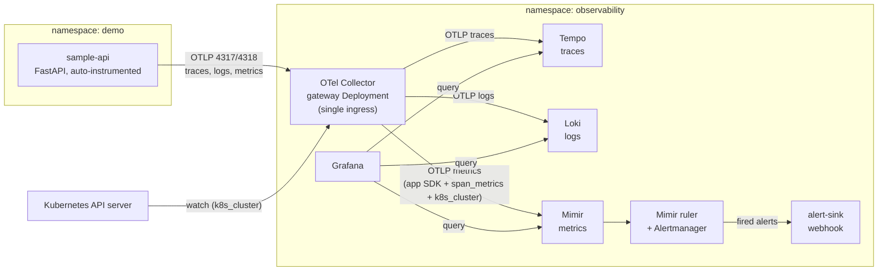
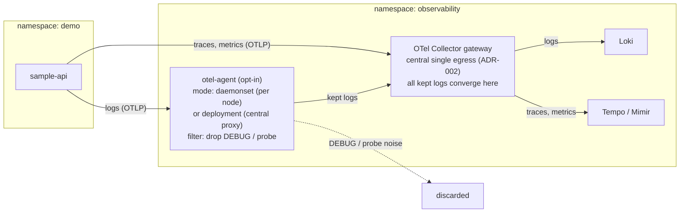
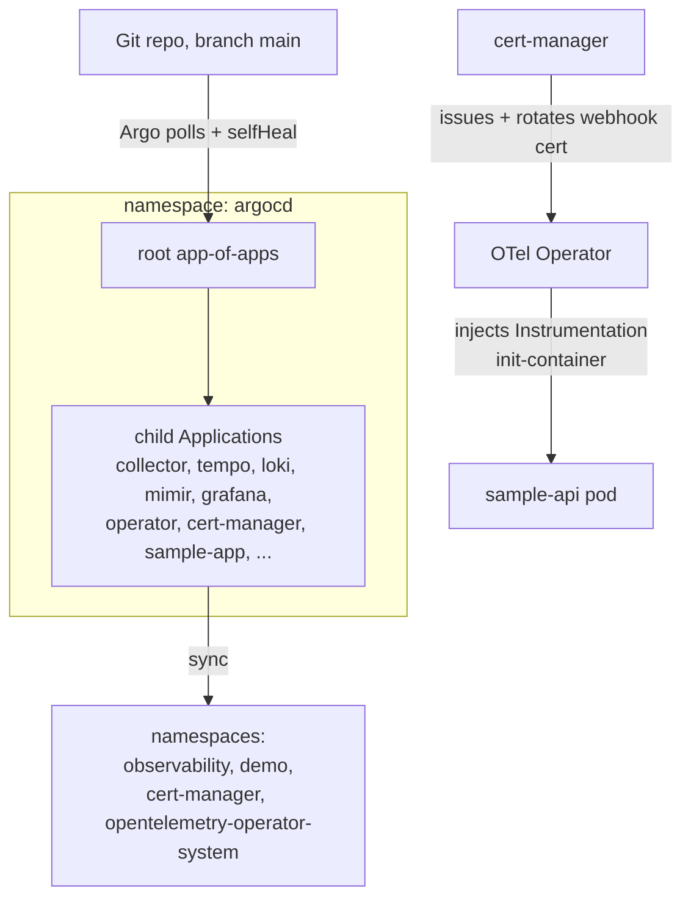

# Architecture

This lab runs an OpenTelemetry Collector as the single telemetry ingress in front
of an LGTM stack (Loki, Grafana, Tempo, Mimir), on a local k3d cluster, delivered
by ArgoCD from `main`. Applications only ever speak OTLP to the Collector; the
Collector is the one place that knows about backends, batching, enrichment, and
routing. This document gives the runtime picture, the delivery picture, and a
consolidated view of every architecture decision (the ADRs in `docs/adr/`).

## Telemetry data flow (runtime)

One span stream from the app fans out to all three signals: the trace goes to
Tempo, the same spans become RED metrics through the `span_metrics` connector, and
logs ride the same OTLP path to Loki. The `k8s_cluster` receiver adds workload
health as metrics without any app change.

Inside the Collector, three pipelines share the OTLP receiver:

- **traces**: `otlp` -> `memory_limiter, resource, batch` -> Tempo (OTLP gRPC),
  and also into the `span_metrics` connector.
- **logs**: `otlp` -> same processors -> Loki (OTLP HTTP `/otlp`).
- **metrics**: `otlp` + `span_metrics` + `k8s_cluster` -> same processors ->
  Mimir (OTLP HTTP through `mimir-gateway`).

The `resource` processor stamps `deployment.environment=lab` on every signal, so
traces, logs, and metrics correlate on the same label. Grafana wires the three
datasources together (Loki log line to Tempo trace, and back), so one click moves
across signals.

**Optional Topology B (Step 6b).** An opt-in node-local agent (a second Collector
as a DaemonSet, `otel-agent`) can sit in front of the gateway on the logs path
only: the app sends its logs to the agent, the agent drops DEBUG/probe noise, and
forwards the rest to the gateway. It offloads the gateway from log noise before it
crosses the network. Traces and metrics still go straight to the gateway, and the
gateway keeps all cluster-singleton work. Off by default; see
[ADR 019](adr/019-optional-agent-tier-for-node-local-log-filtering.md).

Only logs take the two-hop path (app to agent to gateway); traces and metrics go
straight to the gateway. Whichever mode the agent runs in, the kept logs still
converge on the one gateway (ADR-002, single egress); only the dropped noise is
handled differently. The agent's shape is one value, `mode`, in its chart values.
`mode: daemonset` (what we run) puts a pod on every node, so noise is dropped
locally and never crosses the network. `mode: deployment` would make it a central
proxy instead: it still filters before the gateway, but every log first travels to
that proxy, which then bears the full unfiltered ingest. On a single node the two
are equivalent; the difference shows only at multi-node scale, where the DaemonSet
spreads the receive-and-drop load across nodes and keeps dropped volume off the
wire.

## GitOps delivery (control plane)

ArgoCD is installed once with Helm, then manages every other workload as an
app-of-apps from `main`. Every child Application uses automated sync with
`selfHeal`, so the cluster is always reconciled to git. cert-manager and the
OpenTelemetry Operator sit in the control plane: the operator injects the
auto-instrumentation init-container into the app, and cert-manager issues the
operator's webhook serving cert.

Rough sync order (Argo sync-waves): KEDA (-1), cert-manager (-2), operator (0),
backends Tempo/Loki/Mimir (1), Collector (2), then rules, dashboards, and the
sink (3). The app comes up last (wave 4), once the operator and Collector are
ready; KEDA is in early so its `ScaledObject` CRD exists before the app applies
one.

## Components

| Component | Namespace | Role | Source |
|-----------|-----------|------|--------|
| ArgoCD | `argocd` | GitOps engine, app-of-apps | Helm install (ADR 004) |
| cert-manager | `cert-manager` | Issues the operator webhook cert | `jetstack/cert-manager` (ADR 016) |
| OTel Operator | `opentelemetry-operator-system` | Injects auto-instrumentation | operator chart (ADR 010) |
| OTel Collector | `observability` | Single telemetry ingress (gateway) | `opentelemetry-collector` chart (ADR 002, 009) |
| OTel agent (opt-in) | `observability` | Node-local log filter in front of the gateway (Topology B) | `opentelemetry-collector` chart, `mode: daemonset` (ADR 019) |
| Tempo | `observability` | Traces backend | `grafana-community/tempo` (ADR 008) |
| Loki | `observability` | Logs backend | `grafana-community/loki` (ADR 011) |
| Mimir | `observability` | Metrics backend + ruler + Alertmanager | `grafana/mimir-distributed` (ADR 013, 017) |
| Grafana | `observability` | Query and visualisation | `grafana/grafana` (ADR 006, 007) |
| alert-sink | `observability` | Webhook that logs fired alerts | raw manifests (ADR 017) |
| KEDA | `keda` | Autoscaler: scales the app on its request rate | `kedacore/keda` (ADR 020) |
| sample-api | `demo` | The app under observation (and now, scaled by KEDA) | local image, FastAPI |

## Signal pipelines, one line each

- **Traces**: app SDK -> Collector -> Tempo. Auto-instrumented, no SDK in the app
  code (ADR 002).
- **Logs**: app emits OTLP logs -> Collector -> Loki. No node filelog DaemonSet
  (ADR 012).
- **Metrics**: three sources into one Mimir pipeline (ADR 014, 015, 018):
  - the app's own SDK counters (direct OTLP),
  - RED metrics derived from spans by the `span_metrics` connector,
  - workload health from the `k8s_cluster` receiver.
- **Alerting**: rules in git, unit-tested with `promtool`, evaluated in the Mimir
  ruler, routed by the bundled Alertmanager to the webhook sink (ADR 017). Two rule
  sets: app RED (`red-alerts`) and platform health (`platform-health`).
- **Platform health**: `k8s_cluster` watches the API server and alerts when any
  important service is down or crash-looping (ADR 018).
- **Autoscaling**: KEDA reads the app's request rate from Mimir and scales
  sample-api between 1 and 5 replicas (ADR 020). It consumes the same span metric
  Alerting reads; the two are parallel consumers, there is no alert-to-KEDA wire.

## All decisions at a glance (ADR index)

Every choice below is written up in `docs/adr/`. Grouped by theme, with the
decision and the reason in one line.

### Foundation and delivery

| ADR | Decision | Why |
|-----|----------|-----|
| [001](adr/001-lgtm-stack.md) | Use the LGTM stack | Open source, shared S3-style storage, one ops story |
| [003](adr/003-argocd-from-day-one.md) | ArgoCD manages everything from day one | Same GitOps path for every workload, no manual drift |
| [004](adr/004-bootstrap-argocd-with-helm.md) | Bootstrap ArgoCD with `helm install`, not Kustomize inflation | Simplest for a single-env lab; switch is mechanical if that changes |

### Collector as the ingress

| ADR | Decision | Why |
|-----|----------|-----|
| [002](adr/002-collector-as-single-ingress.md) | The Collector is the only telemetry ingress | Backends swap without touching apps; enrichment and batching in one place |
| [009](adr/009-collector-topology-gateway-deployment.md) | Run it as a central gateway Deployment | Cheapest and simplest at lab scale; DaemonSet only when node-local data is needed |
| [019](adr/019-optional-agent-tier-for-node-local-log-filtering.md) | Opt-in node-local agent DaemonSet for early log filtering | Drop log noise on the node, off the gateway's back; gateway stays for singleton work |

### Auto-instrumentation and webhook cert

| ADR | Decision | Why |
|-----|----------|-----|
| [010](adr/010-operator-injection-templates-folder.md) | Operator injection CRs live in their own folder + Application | Adding a language is a new file, not a new Application; ServerSideApply avoids fighting the defaulting webhook |
| [005](adr/005-webhook-cert-without-cert-manager.md) | (Superseded) self-generate the webhook cert | Avoided one dependency, but the `caBundle` drifted and broke injection silently |
| [016](adr/016-webhook-cert-via-cert-manager.md) | Issue + rotate the webhook cert with cert-manager | The cert and its `caBundle` stay reconciled, not snapshotted; no silent expiry |

### Backends and Grafana

| ADR | Decision | Why |
|-----|----------|-----|
| [006](adr/006-grafana-backend-database.md) | Grafana on SQLite in the lab, PostgreSQL only for HA | Nothing precious in the DB; state is provisioned as code |
| [007](adr/007-grafana-datasource-provisioning.md) | Each backend ships its own datasource via the sidecar | Grafana does not need to know which backends exist |
| [008](adr/008-tempo-chart-from-grafana-community.md) | Tempo from `grafana-community/tempo` | The `grafana/tempo` chart is deprecated |
| [011](adr/011-loki-chart-from-grafana-community.md) | Loki from `grafana-community/loki` | Same reason as Tempo |
| [013](adr/013-mimir-distributed-ingest-storage.md) | Mimir as `mimir-distributed` in ingest-storage (Kafka) mode | The chart's happy path and the current production shape; OTLP ingest is identical either way |

### Signal pipelines

| ADR | Decision | Why |
|-----|----------|-----|
| [012](adr/012-logs-via-otlp-not-node-filelog.md) | App logs come in as OTLP, not scraped from node files | One path for all signals, no per-node DaemonSet |
| [014](adr/014-metrics-via-otlp-push-not-remote-write.md) | Metrics reach Mimir as OTLP push, not remote-write | Keeps one protocol out of the Collector; promote resource attributes to labels |
| [015](adr/015-span-metrics-via-collector-spanmetrics-connector.md) | RED metrics from spans via the `span_metrics` connector | One span stream feeds both Tempo and Mimir, no app change |

### Alerting and platform health

| ADR | Decision | Why |
|-----|----------|-----|
| [017](adr/017-metrics-alerting-via-mimir-ruler.md) | Metrics alerting runs in the Mimir ruler, rules in git, `promtool`-tested | Rules are versioned and testable; Grafana-managed alerting kept in reserve |
| [018](adr/018-platform-health-via-k8s-cluster-receiver.md) | Platform self-health via the `k8s_cluster` receiver | OTLP-native, no scrape path, stays on the single gateway (no DaemonSet) |

### Autoscaling

| ADR | Decision | Why |
|-----|----------|-----|
| [020](adr/020-autoscaling-via-keda-prometheus-scaler.md) | Scale the app with KEDA's Prometheus scaler, not the HTTP Add-on | Reuses existing span metrics, no proxy in the data path; git owns the policy, the HPA owns the replica count |

## Deliberate boundaries

Some things are left out on purpose, and the reasons are on record so the gaps are
explicit:

- **The Collector is a shared critical path.** A Collector outage stops telemetry
  ingress. Accepted at lab scale in exchange for centralised routing and policy
  (ADR 002).
- **No general scrape mechanism.** The Prometheus receiver is off. Workload health
  comes from OTLP-native receivers instead (ADR 018). The one thing that will need
  a `prometheus` receiver later is ArgoCD's own app-health metrics, which are
  Prometheus-only.
- **No node-local metrics yet.** Host CPU/memory/disk (`host_metrics`) and per-pod
  cAdvisor stats (`kubelet_stats`) need a DaemonSet agent tier. Deferred (ADR 009
  revisit trigger, ADR 018).
- **No dead-man's switch.** The platform-health alerts share fate with the
  platform. A watchdog to an external receiver is the standard fix, but it needs an
  endpoint outside this single-node cluster, which is out of scope. Documented in
  ADR 018 as a known option, not built.

For how a new capability is judged in or out of scope (produces/moves/stores/shows
telemetry vs consumes it vs unrelated), the working rule is written down in
[scenarios.md, Scenario 9](scenarios.md#9-deciding-what-not-to-build); the short
version is that the Collector's ingest and egress edges are the boundary.

Each gap above is expanded in [scenarios.md](scenarios.md), which indexes these
decisions by the problem they solve rather than by build order, and pairs each one
with its trade-off and the detail that bit us.
